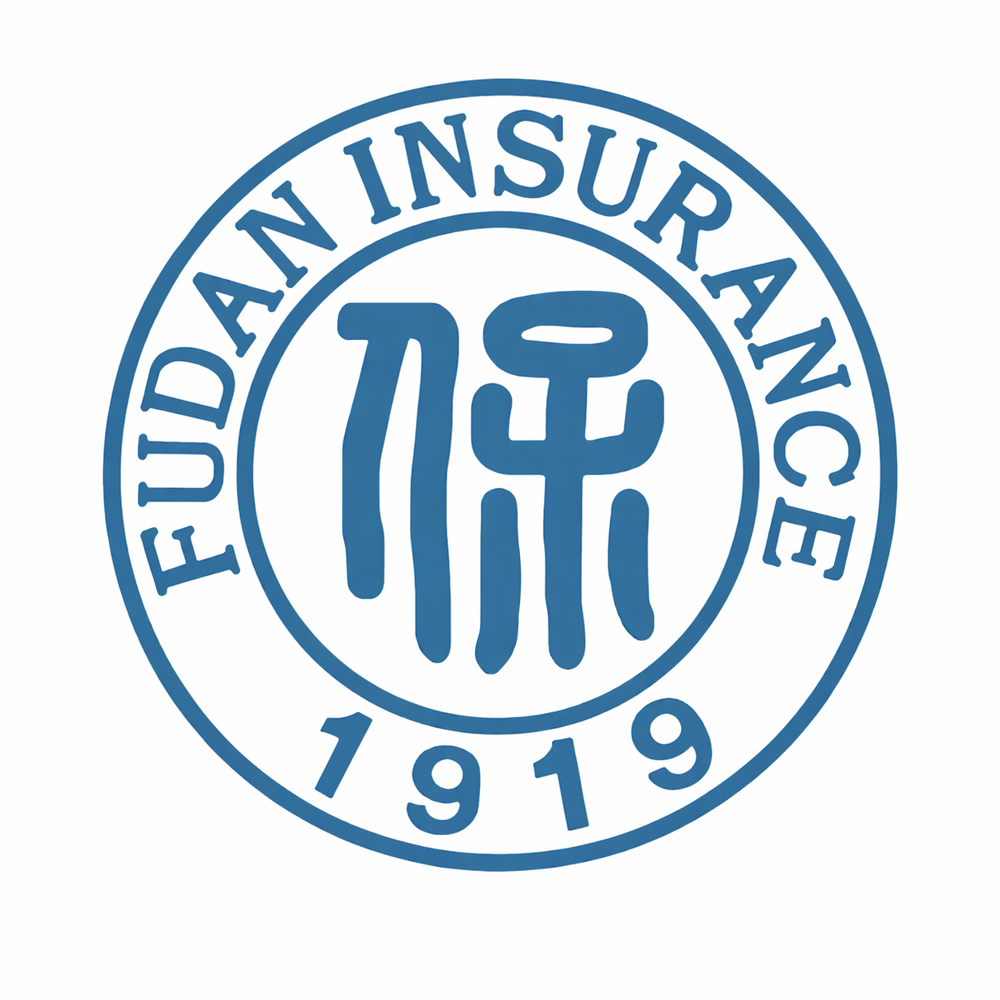

📖 [English version](README_EN.md) · [中文文档](README.md)

  

### 面向保险场景的开源 Skill 基础设施平台

  
  
  

  <a href="https://skills.fduinsurance.com">🌐平台体验地址</a>

  聚焦保险领域 Skill 的汇聚、组织、评估与复用，致力于构建面向保险智能体应用的开放能力底座。

---

## 🔍 什么是Insurance-Skills？

  

**Insurance-Skills** 是由 **复旦大学许闲教授团队** 发起的面向保险场景的开源 Skill 基础设施平台。项目聚焦保险领域 Skill 的**系统汇聚**、**结构化组织**、**多维评测**与**工程化复用**，旨在将保险行业中分散、隐性的业务能力沉淀为可发现、可理解、可比较、可调用、可复用的标准化 Skill 资产。**Insurance-Skills** 不仅是 Skill 的展示入口，也是保险行业能力沉淀、能力评价与能力复用的统一底座。

<table>
  <tr>
    <td width="33%" align="center" style="border: none; padding: 16px;">
      <h3>📦</h3>
      <b>领域能力汇聚平台</b>
        
      多渠道持续收集、整理并沉淀保险领域 Skill，形成可发现、可检索、可复用的能力资产库
    </td>
    <td width="33%" align="center" style="border: none; padding: 16px;">
      <h3>📈</h3>
      <b>领域能力评价平台</b>
        
      建立统一的多维度评测框架，提升 Skill 的可比性、可解释性与选型效率
    </td>
   <td width="33%" align="center" style="border: none; padding: 16px;">
      <h3>⚙️</h3>
      <b>领域能力基础设施平台</b>
        
      为保险 Agent、Copilot、流程自动化与业务系统提供标准化能力底座
    </td>
  </tr>
</table>

## 🧩 覆盖场景

Insurance-Skills 聚焦保险业务流程中最具 Skill 化潜力的核心场景，覆盖从产品咨询、核保理赔到合规风控和运营支持的完整能力空间。

<table width="100%">
  <tr>
    <td width="20%" align="center" valign="top">
      <h3>🛡️</h3>
      <b>产品咨询</b>
        
      产品介绍 责任说明 条款解读 投保问答
    </td>
    <td width="20%" align="center" valign="top">
      <h3>📄</h3>
      <b>保单服务</b>
        
      保单查询 续保提醒 保全办理 批改说明
    </td>
    <td width="20%" align="center" valign="top">
      <h3>🧬</h3>
      <b>核保支持</b>
        
      告知解释 风险问答 材料核验 核保辅助
    </td>
    <td width="20%" align="center" valign="top">
      <h3>🧾</h3>
      <b>理赔服务</b>
        
      理赔报案 材料准备 进度查询 赔付说明
    </td>
    <td width="20%" align="center" valign="top">
      <h3>🎧</h3>
      <b>客服支持</b>
        
      FAQ 标准话术 流程引导 坐席辅助
    </td>
  </tr>
  <tr>
    <td width="20%" align="center" valign="top">
      <h3>🎯</h3>
      <b>营销推荐</b>
        
      客户触达 需求匹配 产品推荐 转化支持
    </td>
    <td width="20%" align="center" valign="top">
      <h3>⚖️</h3>
      <b>合规风控</b>
        
      规则校验 异常识别 流程合规 权限控制
    </td>
    <td width="20%" align="center" valign="top">
      <h3>📊</h3>
      <b>运营支持</b>
        
      日常运营 流程协同 数据整理 任务追踪
    </td>
    <td width="20%" align="center" valign="top">
      <h3>🎓</h3>
      <b>知识问答</b>
        
      制度解释 业务培训 流程说明 知识服务
    </td>
    <td width="20%" align="center" valign="top">
      <h3>🤖</h3>
      <b>能力编排</b>
        
      工具调用 任务拆解 流程执行 结果校验
    </td>
  </tr>
</table>

## ✨ 核心亮点

Insurance-Skills 面向保险智能体建设，提供一套可发现、可比较、可评测、可集成的领域 Skill 基础设施。平台将分散在不同来源、不同业务场景中的保险能力沉淀为结构化资产，帮助团队更快完成能力选型、方案验证与工程落地。

<table>
  <tr>
    <td width="25%" align="center">
      <h3>🔭</h3>
      <b>Skill收集</b>
        
      多渠道持续收集保险场景 Skill，覆盖咨询、核保、理赔、客服、风控、运营等高频业务环节
    </td>
    <td width="25%" align="center">
      <h3>⚡</h3>
      <b>快速检索</b>
        
      基于场景、标签、功能方向和质量特征进行快速检索，降低 Skill 查找与理解成本
    </td>
    <td width="25%" align="center">
      <h3>🧩</h3>
      <b>良好集成</b>
        
      围绕使用方式、输入输出、依赖条件和风险边界进行标准化描述，便于接入保险 Agent 流程
    </td>
    <td width="25%" align="center">
      <h3>📊</h3>
      <b>质量评估</b>
        
      建立多维度 Skill 评测体系，支持横向比较、质量筛选、持续治理和版本迭代
    </td>
  </tr>
</table>

## 🧠 评分框架

Insurance-Skills 不只收录 Skill，也关注 Skill 是否真正可用、可控、可维护。我们构建了一套面向保险场景的Skill评估框架。框架从清晰度、完整度、可操作性、可维护性和安全性五个维度对样本进行规则化质量评估，并通过九个完整覆盖保险数据、业务安全的标签进行规则化风险评估。

  
  &nbsp;&nbsp;&nbsp;&nbsp;
  

## 📈 评分等级

<table>
  <tr>
    <th align="center">Score</th>
    <th align="center">Status</th>
    <th align="center">Recommendation</th>
  </tr>
  <tr>
    <td align="center"><b>0–3</b></td>
    <td align="center">Weak</td>
    <td>信息缺失明显，不建议直接用于生产环境</td>
  </tr>
  <tr>
    <td align="center"><b>4–6</b></td>
    <td align="center">Usable</td>
    <td>可在受控范围试用，但需要补充边界和复现说明</td>
  </tr>
  <tr>
    <td align="center"><b>7–8</b></td>
    <td align="center">Reliable</td>
    <td>结构清晰，路径明确，可用于常规业务场景</td>
  </tr>
  <tr>
    <td align="center"><b>9–10</b></td>
    <td align="center">Excellent</td>
    <td>文档完善，执行稳定，可作为模板或基线 Skill</td>
  </tr>
</table>

## ⚙️ 平台功能展示

Insurance-Skills 围绕 Skill 的发现、理解、评测和复用构建平台能力。用户可以通过统一入口浏览不同保险场景下的 Skill，查看结构化说明与质量评分，并据此开展能力筛选、方案比较和集成验证。

  

## 🛣️ 路线图

我们希望平台不仅是一个 Skill 展示库，也能够逐步演化为保险智能体能力建设、质量治理和行业协作的开放基础设施。Insurance-Skills 将围绕保险智能体建设持续迭代，未来将重点推进保险 Skill 的动态收集与更新，完善保险 Skill 深度测评标准，探索保险场景智能体建设应用，并进一步开展保险智能体可信应用、安全治理和生态协同研究。

## 🌐 关于我们

  

复旦大学许闲教授团队长期立足风险管理与保险学科，聚焦大语言模型、多智能体系统、可信人工智能等前沿技术在金融、保险领域中的跨学科创新结合与应用。团队致力于打通学科问题、模型方法与行业场景之间的连接，开展具有理论深度、方法先进性和现实解释力的交叉研究。我们希望以风险管理与保险中的真实问题为牵引，推动前沿模型技术从可用走向可信、可解释、可落地，形成既服务学术创新，又回应中国保险行业实践需求的研究成果。

我们将持续建设兼具模型研发能力、学科洞察能力和产业转化能力的研究平台，成为保险学术研究、智能技术创新与行业应用实践之间的重要连接者。

## 🤝 欢迎交流与合作

欢迎大家对本项目提出优化建议、反馈使用体验，并参与相关能力的共建与完善。

同时，我们期待开展更深入的沟通、合作与探索。如果你对保险科技、保险场景智能体应用、可信 AI 评估、行业应用验证或相关交叉研究感兴趣，欢迎与我们联系。我们也欢迎对本方向有长期兴趣的同学、研究者加入我们，共同推动保险科技的创新与落地应用。

**联系邮箱：** [insurance(at)fudan(dot)edu(dot)cn](mailto:insurance@fudan.edu.cn)

**填写问卷：**

  

**Insurance-Skills**

Building reusable, evaluable and trustworthy Skills for insurance agents.

