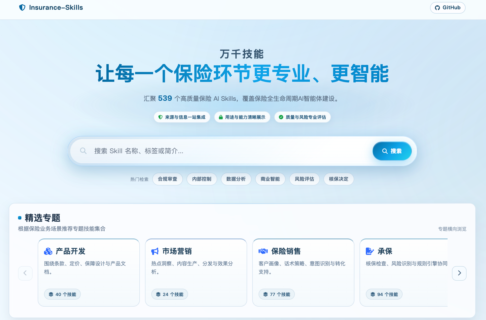

📖 [English version](README_EN.md) · [中文文档](README.md)
<div align="center">
  

### 面向保险场景的开源 Skill 基础设施平台

<p>
  <a href="LICENSE">
    
  </a>
  <a href="#">
    
  </a>
  <a href="#项目背景">
    
  </a>
</p>

<p>
  <a href="https://skills.fduinsurance.com">🌐平台体验地址</a>
</p>

<p>
  聚焦保险领域 Skill 的汇聚、组织、评估与复用，致力于构建面向保险智能体应用的开放能力底座。
</p>
</div>


# 🛡️ Insurance-Skills

### 面向保险场景的开源 Skill 基础设施平台

<p>
  
  
  
  
</p>

</div>

---

## 🚀 项目概览

**Insurance-Skills** 是由 **复旦大学许闲教授团队** 发起的面向保险场景的开源 Skill 基础设施平台。

项目聚焦保险领域 Skill 的 **系统汇聚**、**结构化组织**、**多维评测** 与 **工程化复用**，旨在将保险行业中分散、隐性的业务能力沉淀为可发现、可理解、可比较、可调用、可复用的标准化 Skill 资产。

---

## 🧩 为什么需要 Insurance-Skills

随着大模型与智能体技术快速进入产业场景，保险行业正在从 **模型可用** 走向 **业务可落地**。

然而，保险业务并不是通用问答场景。它具有明显的行业复杂性。

<div align="center">

| 🔗 链条长 | 📜 规则强 | 🧠 术语密 | ⚠️ 风险高 | 🏗️ 流程复杂 |
|:--:|:--:|:--:|:--:|:--:|
| 多主体协同 | 强监管约束 | 专业语义密集 | 高合规要求 | 多环节决策 |

</div>

这使得通用大模型在面对保险业务时，往往难以稳定完成条款解读、核保辅助、理赔支持、客服问答、合规校验等高专业度任务。

因此，**Skill 成为连接通用模型能力与保险业务场景的关键中介层**。

---

## 🛠️ 平台定位

Insurance-Skills 希望通过 **平台化**、**开源化**、**标准化** 的方式，构建面向保险行业的 Skill 基础设施。

<div align="center">

```mermaid
flowchart LR
    A[通用大模型] --> B[保险 Skill 层]
    B --> C[保险 Agent]
    B --> D[业务 Copilot]
    B --> E[流程自动化]
    B --> F[知识服务]
    B --> G[业务智能化]

---

<div align="center">

## 🌐 平台主页展示



<br>

<p>
  
  
  
</p>

</div>

---

## 🧭 项目背景

当前，保险 Agent 建设正在从概念验证走向真实业务落地，但在保险场景中，Skill 的发现、设计、评价与复用仍然存在明显断点。

<table>
  <tr>
    <td width="25%" align="center">
      <h3>🔍</h3>
      <b>Skill 难发现</b>
      <br>
      <sub>高质量、可复用、贴近业务的保险 Skill 仍然稀缺</sub>
    </td>
    <td width="25%" align="center">
      <h3>🧩</h3>
      <b>设计难统一</b>
      <br>
      <sub>许多保险场景缺乏统一描述方式与沉淀范式</sub>
    </td>
    <td width="25%" align="center">
      <h3>📊</h3>
      <b>质量难比较</b>
      <br>
      <sub>同类 Skill 在边界、输入输出、依赖条件与说明质量上差异较大</sub>
    </td>
    <td width="25%" align="center">
      <h3>🔌</h3>
      <b>集成难落地</b>
      <br>
      <sub>缺乏统一入口、标准化展示与低门槛接入方式</sub>
    </td>
  </tr>
</table>

**Insurance-Skills** 正是围绕这些问题而建立。我们希望为保险场景构建一个兼顾 **能力组织、质量评价与工程复用** 的基础设施平台，让保险 Skill 从零散工具走向系统化资产。

---

## 🏗️ 平台定位

**Insurance-Skills** 是一个面向保险智能化应用的领域能力基础设施平台。它不仅是 Skill 的展示入口，也是保险行业能力沉淀、能力评价与能力复用的统一底座。

<table>
  <tr>
    <td width="33%" align="center">
      <h3>📦</h3>
      <b>领域能力汇聚平台</b>
      <br><br>
      <sub>多渠道持续收集、整理并沉淀保险领域相关 Skill，形成可发现、可检索、可复用的能力资产库</sub>
    </td>
    <td width="33%" align="center">
      <h3>📈</h3>
      <b>领域能力评价平台</b>
      <br><br>
      <sub>建立统一的多维度评测框架，提升 Skill 的可比性、可解释性与选型效率</sub>
    </td>
    <td width="33%" align="center">
      <h3>⚙️</h3>
      <b>领域能力基础设施平台</b>
      <br><br>
      <sub>为保险 Agent、Copilot、流程自动化与业务系统提供标准化能力底座</sub>
    </td>
  </tr>
</table>

<div align="center">

```mermaid
flowchart LR
    A[保险业务场景] --> B[Skill 结构化沉淀]
    B --> C[多维质量评测]
    C --> D[标准化展示与检索]
    D --> E[Agent / Copilot / 自动化系统接入]

Insurance-Skills 当前聚焦保险业务流程中最具 Skill 化潜力的核心场景，覆盖从产品咨询、核保理赔到合规风控和运营支持的完整能力空间。

<table> <tr> <td align="center" width="20%"> <h3>🛡️</h3> <b>产品咨询</b> <br> <sub>产品介绍<br>责任说明<br>条款解读<br>投保问答</sub> </td> <td align="center" width="20%"> <h3>📄</h3> <b>保单服务</b> <br> <sub>保单查询<br>续保提醒<br>保全办理<br>批改说明</sub> </td> <td align="center" width="20%"> <h3>🧬</h3> <b>核保支持</b> <br> <sub>健康告知解释<br>风险问答<br>材料核验<br>核保辅助</sub> </td> <td align="center" width="20%"> <h3>🧾</h3> <b>理赔服务</b> <br> <sub>理赔报案<br>材料准备<br>进度查询<br>赔付说明</sub> </td> <td align="center" width="20%"> <h3>🎧</h3> <b>客服支持</b> <br> <sub>FAQ<br>标准话术<br>流程引导<br>坐席辅助</sub> </td> </tr> <tr> <td align="center" width="20%"> <h3>🎯</h3> <b>营销与推荐</b> <br> <sub>客户触达<br>需求匹配<br>产品推荐<br>转化支持</sub> </td> <td align="center" width="20%"> <h3>⚖️</h3> <b>合规与风控</b> <br> <sub>规则校验<br>异常识别<br>流程合规<br>权限控制</sub> </td> <td align="center" width="20%"> <h3>📊</h3> <b>运营支持</b> <br> <sub>日常运营辅助<br>流程协同<br>数据整理<br>任务追踪</sub> </td> <td align="center" width="20%"> <h3>🎓</h3> <b>培训与知识问答</b> <br> <sub>制度解释<br>业务培训<br>流程说明<br>知识服务</sub> </td> <td align="center" width="20%"> <h3>🤖</h3> <b>Agent 能力编排</b> <br> <sub>工具调用<br>任务拆解<br>流程执行<br>结果校验</sub> </td> </tr> </table>

## 平台核心亮点

### 1. 多渠道汇聚与持续更新

保险业务场景高度细分，不同险种、流程节点和组织角色对 Skill 的需求差异显著。Insurance-Skills 通过多渠道持续收集和整理保险相关 Skill，并不断扩充覆盖范围，努力构建一份更完整、更具时效性的保险 Skill 能力地图。

目前，平台已围绕多个高频保险业务环节启动 Skill 收集与整理工作，覆盖方向包括但不限于：

- 保险产品咨询
- 保单服务
- 核保支持
- 理赔服务
- 客服助手
- 营销与推荐
- 合规与风控
- 运营支持
- 培训与知识问答

随着平台持续迭代，Insurance-Skills 将进一步完善标签体系与场景分类体系，提升 Skill 库的更新效率与覆盖广度。

### 2. 快速检索与结构化展示

面对数量不断增长、来源不断扩展的保险 Skill，如何快速找到合适能力并清晰理解其适用场景与边界，是保险智能体建设中的关键问题。

围绕这一需求，Insurance-Skills 提供统一检索入口和标准化展示方式，帮助用户更高效地完成 Skill 的查找、识别、理解与初步选型。用户可基于业务场景、功能方向和标签分类快速检索相关 Skill，并进一步查看其功能说明、适用场景、使用方式及相关特征信息。

相较于在分散渠道中逐一筛选和理解不同 Skill，平台通过结构化呈现显著降低了信息获取成本。

### 3. 一站式集成导向，降低使用门槛

在保险 Agent 建设中，“找到 Skill”只是第一步，真正的难点往往在于如何将 Skill 接入现有流程并投入使用。

为此，Insurance-Skills 不仅关注 Skill 的展示与收录，也关注从“发现 Skill”到“接入 Skill”的实际过程，支持围绕 Skill 的检索、查看、对比、选择、集成与使用等关键步骤开展能力建设，尽可能降低从“找到 Skill”到“真正用起来”的门槛。

对于保险公司数字化团队、产品团队和技术团队而言，这意味着可以在统一平台中更高效地完成选型、验证与集成，加快保险智能体项目从概念验证走向可用版本。

### 4. 多维度测评体系，提升 Skill 可比性

面对同一保险场景，往往会存在多个 Skill 方案。传统做法下，团队很难快速判断哪个更适合自己、哪个更成熟、哪个风险更可控。

为此，Insurance-Skills 建立了面向保险 Skill 的多维度评测机制，从以下五个维度对 Skill 进行评价与打分：

- **清晰度（clarity）**
- **完整度（completeness）**
- **可操作性（operability）**
- **可维护性（maintainability）**
- **安全性（security）**

该评测框架回答三个关键问题：

1. 某个 Skill 是否适合当前业务场景？
2. 同类 Skill 之间谁更优？
3. 哪些 Skill 更适合优先进入候选池？


## Skill 评测框架

Insurance-Skills 的质量评估综合考察 Skill 在表达质量、信息覆盖、执行可行性、长期维护性与风险控制能力等多个方面的表现。

### 一级评价维度

| 维度 | 含义 |
| --- | --- |
| 清晰度（clarity） | 衡量 Skill 文档是否表达清楚、结构是否易于理解 |
| 完整度（completeness） | 衡量 Skill 是否覆盖关键字段、章节与依赖信息 |
| 可操作性（operability） | 衡量用户是否能够依据文档直接执行并复现结果 |
| 可维护性（maintainability） | 衡量 Skill 是否便于版本跟踪、持续更新与长期维护 |
| 安全性（security） | 衡量凭证、数据、影响范围与破坏性操作的风险控制能力 |

### 二级评价准则

| 一级维度 | 二级准则 |
| --- | --- |
| 清晰度 | 命名质量、结构质量、描述质量、示例清晰度 |
| 完整度 | 字段覆盖、证据覆盖、章节覆盖、依赖完整性 |
| 可操作性 | 搭建难易、执行清晰、异常指引、可复现性 |
| 可维护性 | 版本跟踪、模块化程度、抗过时能力、文档健康度 |
| 安全性 | 凭证安全、数据暴露风险、影响范围控制、破坏性控制 |

### 分值区间解释

| 分数区间 | 中文解释 | 使用建议 | 常见状态 |
| --- | --- | --- | --- |
| 0–3 | 基础薄弱 | 不建议直接用于生产场景 | 信息缺失较多，步骤不可执行 |
| 4–6 | 可用但存在明显缺口 | 可在受控范围内试用 | 能理解部分流程，但复现稳定性不足 |
| 7–8 | 质量较好 | 可用于常规场景 | 结构较清晰，执行路径较明确 |
| 9–10 | 高质量 | 可作为模板或基线 Skill | 文档完善，风险控制较好 |

---

### ⚙️ 平台功能展示

<p align="center">
  
</p>

## 路线图

### 🚧未来我们将持续迭代与优化
- 保险 Skill 动态收集更新
- 保险 Skill 深度测评标准
- 保险场景智能体建设与应用
- 保险智能体可信应用研究


## 团队愿景

我们立足保险与风险管理学科，聚焦**大语言模型**、**多智能体系统**等前沿人工智能技术在保险与风险管理中的创新结合与应用。团队致力于打通学科问题、模型方法与行业场景之间的连接，开展具有理论深度、方法先进性和现实解释力的交叉研究。我们希望以保险与风险管理中的真实问题为牵引，推动前沿模型技术**从“可用”走向“可信、可解释、可落地”**，形成既服务学术创新、又回应中国保险行业实践需求的研究成果。我们致力于建设兼具模型研发能力、学科洞察能力和产业转化能力的研究平台，成为保险学术研究、智能技术创新与行业应用实践之间的重要连接者。

## 📫联系我们

我们欢迎更多保险公司、开发者、合作伙伴通过多种方式参与共建，推动保险场景下的智能体、Skill能力建设。也欢迎感兴趣的研究者加入团队，共同探索保险领域智能体Skill在场景设计、质量评估、安全治理与生态协同方面的关键问题。

**联系邮箱：**   [insurance (at) fudan (dot) edu (dot) cn](mailto:insurance@fudan.edu.cn)

**填写问卷：** 

<p align="center">
  
</p>
