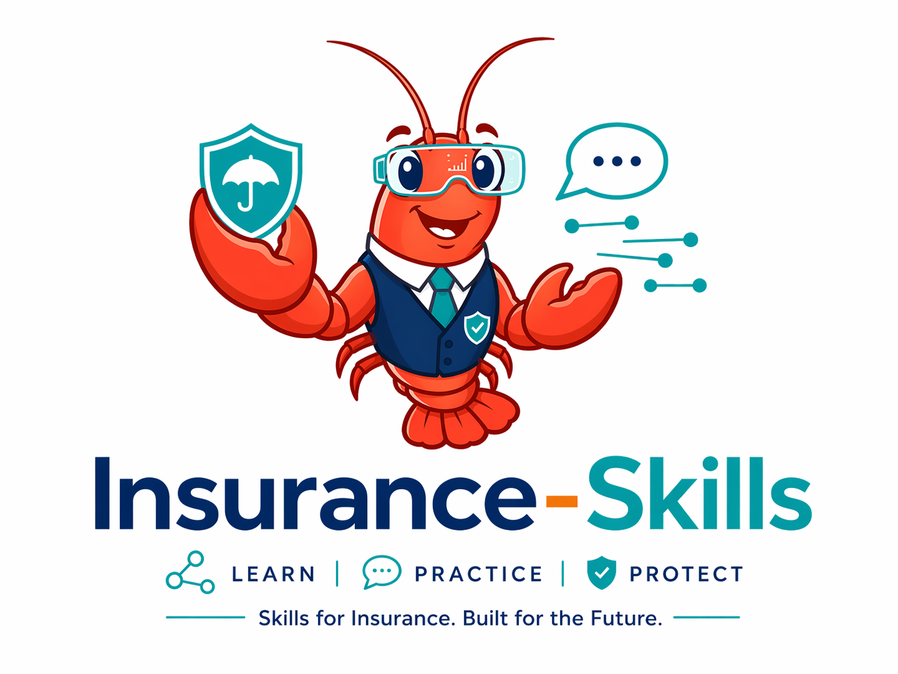
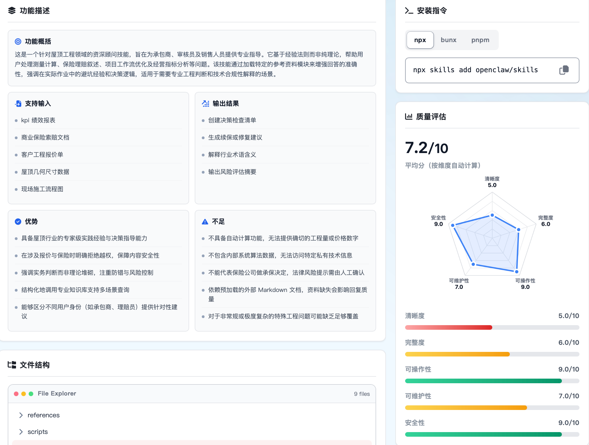

> 📖 Chinese version: [README_中文.md](README.md)
> 

  

### An Open-Source Skill Infrastructure Platform for Insurance Scenarios

  
  
  

  <a href="https://skills.fduinsurance.com">🌐 Platform Experience URL</a>

  Focusing on the aggregation, organization, evaluation, and reuse of Skills in the insurance domain, the platform is committed to building an open capability foundation for insurance agent applications.

# 🛡️ Insurance-Skills

### An Open-Source Skill Infrastructure Platform for Insurance Scenarios

  
  
  
  

**Insurance-Skills** is an open-source Skill infrastructure platform for insurance scenarios, initiated by **Professor Xu Xian’s team at Fudan University**.

The project focuses on the **systematic aggregation**, **structured organization**, **multi-dimensional evaluation**, and **engineering reuse** of Skills in the insurance domain. It aims to transform the dispersed and implicit business capabilities within the insurance industry into standardized Skill assets that are discoverable, understandable, comparable, callable, and reusable.

  
  
  

---

## 🏗️ Platform Positioning

**Insurance-Skills** is a domain capability infrastructure platform for intelligent insurance applications. It is not only an entry point for displaying Skills, but also a unified foundation for capability accumulation, capability evaluation, and capability reuse in the insurance industry.

<table>
  <tr>
    <td width="33%" align="center">
      <h3>📦</h3>
      <b>Domain Capability Aggregation Platform</b>
        
      Continuously collects, organizes, and accumulates insurance-related Skills through multiple channels, forming a discoverable, searchable, and reusable capability asset library
    </td>
    <td width="33%" align="center">
      <h3>📈</h3>
      <b>Domain Capability Evaluation Platform</b>
        
      Establishes a unified multi-dimensional evaluation framework to improve the comparability, interpretability, and selection efficiency of Skills
    </td>
    <td width="33%" align="center">
      <h3>⚙️</h3>
      <b>Domain Capability Infrastructure Platform</b>
        
      Provides a standardized capability foundation for insurance Agents, Copilots, process automation, and business systems
    </td>
  </tr>
</table>

---

## 🧩 Covered Scenarios

Insurance-Skills currently focuses on core scenarios in insurance business processes with the greatest potential for Skill-based implementation. It covers a complete capability space ranging from product consultation, underwriting and claims, to compliance risk control and operational support.

<table>
  <tr>
    <td align="center" width="10%">
      <h3>🛡️</h3>
      <b>Product Consultation</b>
       
      Product Introduction Liability Explanation Policy Clause Interpretation Insurance Application Q&A
    </td>
    <td align="center" width="10%">
      <h3>📄</h3>
      <b>Policy Services</b>
       
      Policy Inquiry Renewal Reminder Policy Servicing Endorsement Explanation
    </td>
    <td align="center" width="10%">
      <h3>🧬</h3>
      <b>Underwriting Support</b>
       
      Health Disclosure Explanation Risk Q&A Material Verification Underwriting Assistance
    </td>
    <td align="center" width="10%">
      <h3>🧾</h3>
      <b>Claims Services</b>
       
      Claim Reporting Material Preparation Progress Inquiry Payment Explanation
    </td>
    <td align="center" width="10%">
      <h3>🎧</h3>
      <b>Customer Service Support</b>
       
      FAQ Standard Scripts Process Guidance Agent Assistance
    </td>
    <td align="center" width="10%">
      <h3>🎯</h3>
      <b>Marketing and Recommendation</b>
       
      Customer Outreach Demand Matching Product Recommendation Conversion Support
    </td>
    <td align="center" width="10%">
      <h3>⚖️</h3>
      <b>Compliance and Risk Control</b>
       
      Rule Verification Anomaly Identification Process Compliance Permission Control
    </td>
    <td align="center" width="10%">
      <h3>📊</h3>
      <b>Operational Support</b>
       
      Daily Operation Assistance Process Collaboration Data Organization Task Tracking
    </td>
    <td align="center" width="10%">
      <h3>🎓</h3>
      <b>Training and Knowledge Q&A</b>
       
      Policy Explanation Business Training Process Description Knowledge Services
    </td>
    <td align="center" width="10%">
      <h3>🤖</h3>
      <b>Agent Capability Orchestration</b>
       
      Tool Invocation Task Decomposition Process Execution Result Verification
    </td>
  </tr>
</table>

---

## ✨ Core Highlights

Insurance-Skills provides a domain Skill infrastructure for insurance agent development that is discoverable, comparable, evaluable, and integrable. The platform transforms insurance capabilities dispersed across different sources and business scenarios into structured assets, helping teams complete capability selection, solution validation, and engineering implementation more efficiently.

<table>
  <tr>
    <td width="25%" align="center">
      <h3>🔭</h3>
      <b>Skill Discovery</b>
        
      Continuously collects insurance scenario Skills through multiple channels, covering high-frequency business processes such as consultation, underwriting, claims, customer service, risk control, and operations
    </td>
    <td width="25%" align="center">
      <h3>⚡</h3>
      <b>Fast Retrieval</b>
        
      Supports fast retrieval based on scenarios, tags, functional directions, and quality features, reducing the cost of finding and understanding Skills
    </td>
    <td width="25%" align="center">
      <h3>🧩</h3>
      <b>Integration Ready</b>
        
      Provides standardized descriptions around usage methods, inputs and outputs, dependencies, and risk boundaries, facilitating integration into insurance Agent workflows
    </td>
    <td width="25%" align="center">
      <h3>📊</h3>
      <b>Quality Evaluation</b>
        
      Establishes a multi-dimensional Skill evaluation system to support horizontal comparison, quality screening, continuous governance, and version iteration
    </td>
  </tr>
</table>

---

## 🧠 Scoring Framework

Insurance-Skills not only includes Skills, but also focuses on whether Skills are truly usable, controllable, and maintainable. Through a unified evaluation framework, the platform systematically evaluates each Skill’s documentation quality, execution path, engineering reproducibility, and safety boundaries.

<table>
  <tr>
    <th align="center">Dimension</th>
    <th align="center">Identifier</th>
    <th align="center">Evaluation Focus</th>
  </tr>
  <tr>
    <td align="center"><b>Clarity</b></td>
    <td align="center"><code>clarity</code></td>
    <td>Whether the name, structure, description, and examples are clear and easy to understand</td>
  </tr>
  <tr>
    <td align="center"><b>Completeness</b></td>
    <td align="center"><code>completeness</code></td>
    <td>Whether fields, sections, dependencies, and evidence information are sufficient</td>
  </tr>
  <tr>
    <td align="center"><b>Operability</b></td>
    <td align="center"><code>operability</code></td>
    <td>Whether execution, verification, and reproduction can be completed based on the documentation</td>
  </tr>
  <tr>
    <td align="center"><b>Maintainability</b></td>
    <td align="center"><code>maintainability</code></td>
    <td>Whether it facilitates version management, module reuse, and long-term updates</td>
  </tr>
  <tr>
    <td align="center"><b>Security</b></td>
    <td align="center"><code>security</code></td>
    <td>Whether risks related to credentials, data, permissions, and destructive operations are clearly controlled</td>
  </tr>
</table>

---

## 📈 Scoring Levels

<table>
  <tr>
    <th align="center">Score</th>
    <th align="center">Status</th>
    <th align="center">Recommendation</th>
  </tr>
  <tr>
    <td align="center"><b>0–3</b></td>
    <td align="center">Weak</td>
    <td>Information is significantly missing, and direct use in production environments is not recommended</td>
  </tr>
  <tr>
    <td align="center"><b>4–6</b></td>
    <td align="center">Usable</td>
    <td>Can be tested within a controlled scope, but boundaries and reproduction instructions need to be supplemented</td>
  </tr>
  <tr>
    <td align="center"><b>7–8</b></td>
    <td align="center">Reliable</td>
    <td>The structure is clear and the path is explicit, making it suitable for regular business scenarios</td>
  </tr>
  <tr>
    <td align="center"><b>9–10</b></td>
    <td align="center">Excellent</td>
    <td>The documentation is complete and execution is stable, making it suitable as a template or baseline Skill</td>
  </tr>
</table>

---

## 🎯 What We Can Do

<table>
  <tr>
    <td align="center"><b>Find</b></td>
    <td>Identify which insurance Skills are available for the current business scenario</td>
  </tr>
  <tr>
    <td align="center"><b>Compare</b></td>
    <td>Determine which Skill among similar Skills is more mature, more stable, and more controllable</td>
  </tr>
  <tr>
    <td align="center"><b>Build</b></td>
    <td>Identify which Skills are suitable for inclusion in the candidate pool for insurance agent development</td>
  </tr>
</table>

---

## ⚙️ Platform Function Display

  

Insurance-Skills builds platform capabilities around the discovery, understanding, evaluation, and reuse of Skills. Users can browse Skills across different insurance scenarios through a unified entry point, view structured descriptions and quality scores, and use them to conduct capability screening, solution comparison, and integration validation.

---

## 🛣️ Roadmap

**Insurance-Skills will continue to iterate around insurance agent development.** In the future, the platform will focus on advancing the dynamic collection and updating of insurance Skills, improving in-depth evaluation standards for insurance Skills, exploring methods for building agents in insurance scenarios, and further conducting research on trustworthy applications, safety governance, and ecosystem collaboration for insurance agents.

We hope that the platform will not only serve as a Skill display library, but also gradually evolve into an open infrastructure for insurance agent capability development, quality governance, and industry collaboration.

---

## 📫 Contact Us

Rooted in the disciplines of insurance and risk management, we focus on the innovative integration and application of frontier technologies such as large language models, multi-agent systems, and trustworthy artificial intelligence in insurance and risk management.

We are committed to bridging disciplinary problems, model methods, and industry scenarios, and to conducting interdisciplinary research with theoretical depth, methodological advancement, and practical interpretability. Guided by real problems in insurance and risk management, we hope to promote the transition of frontier model technologies from usable to trustworthy, interpretable, and implementable, producing research outcomes that both serve academic innovation and respond to the practical needs of China’s insurance industry.

We will continue to build a research platform that integrates model development capabilities, disciplinary insight, and industrial transformation capabilities, becoming an important connector among insurance academic research, intelligent technology innovation, and industry application practice.

**We welcome the following types of exchanges and collaborations**:

- Co-building insurance scenario Skills
- Joint research on Skill tag systems and evaluation frameworks
- Validation of insurance Agent / Copilot scenarios
- Joint research among universities, institutions, and industry
- Project demonstrations, methodology sharing, and case exchanges

**Contact Email**

[insurance@fudan.edu.cn](mailto:insurance@fudan.edu.cn)

**Fill Out the Questionnaire**

  

---

**Insurance-Skills**

Building reusable, evaluable and trustworthy Skills for insurance agents.

