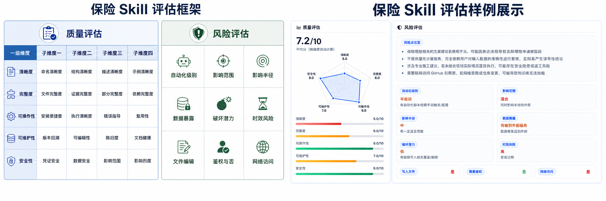
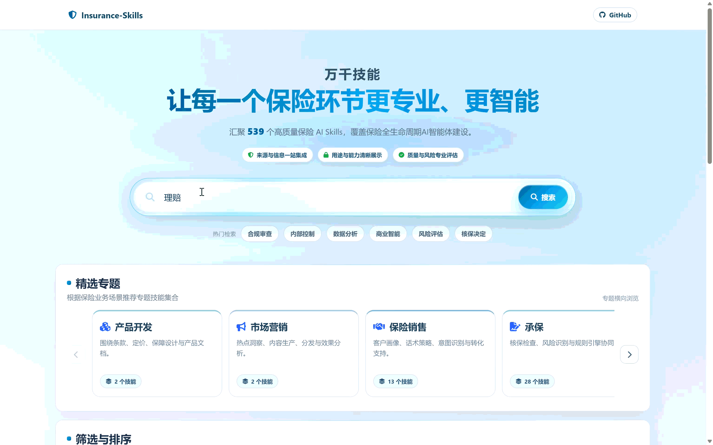
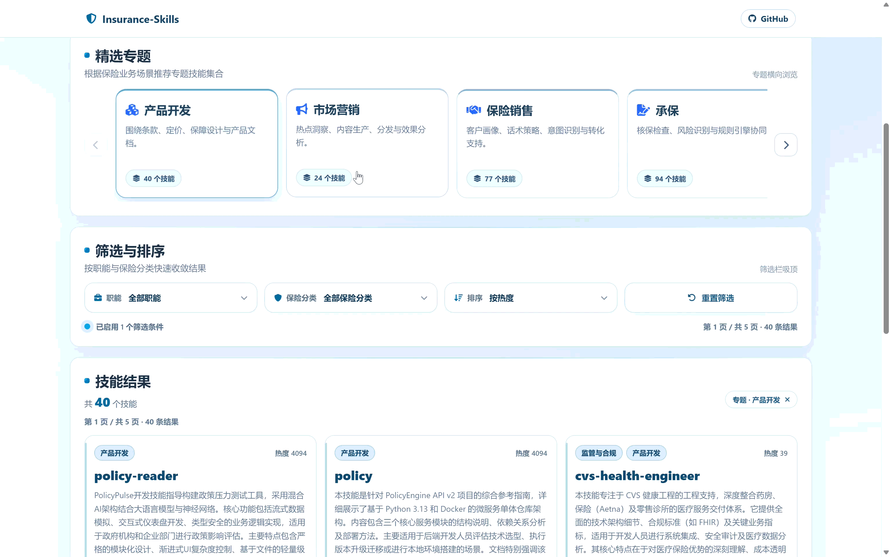

📖 [English version](README_EN.md) · [中文文档](README.md)

  

### An Open-Source Skill Infrastructure Platform for Insurance Scenarios

  
  
  

  <a href="https://skills.fduinsurance.com">🌐 Platform URL</a>

> Recently, concepts such as “Lobster”, agents, and Skills have continued to gain momentum, rapidly moving from technical communities into broader industrial discussions. More and more people are beginning to realize that being able to chat is not real competence for large models. Being able to underwrite, handle claims, and resolve customer service challenges is the true “hard currency” of insurance AI. As an agent’s “professional skill package”, a Skill encapsulates scenario-specific capabilities such as underwriting rules, claims processes, and customer service scripts into plug-and-play modules, thereby enabling agents to truly enter insurance business operations.
>
> In actual implementation, however, the industry commonly faces four major challenges:
> 
> Scarcity: there are too few high-quality Skills that truly fit insurance scenarios;
> 
> Difficulty: it is unclear how scenario-based Skills should be designed and accumulated;
> 
> Disorder: Skills of the same category vary greatly in quality, making it difficult to quickly judge their merits;
> 
> Slowness: even when usable capabilities are found, there is still a lack of unified and low-threshold integration methods.
>
> **Insurance-Skills** was created precisely to solve these problems. It focuses on the aggregation, organization, evaluation, and reuse of Skills in the insurance domain, and is committed to building an open capability foundation for insurance agent applications.

---

## 🔍 What Is Insurance-Skills?

  

**Insurance-Skills** is an open-source Skill infrastructure platform for insurance scenarios initiated by **Professor Xian Xu’s team at Fudan University**. The project focuses on the **systematic aggregation**, **structured organization**, **multi-dimensional evaluation**, and **engineering-oriented reuse** of Skills in the insurance domain. It aims to transform the scattered and implicit business capabilities in the insurance industry into standardized Skill assets that are discoverable, understandable, comparable, callable, and reusable. **Insurance-Skills** is not only an entry point for displaying Skills, but also a unified foundation for capability accumulation, capability evaluation, and capability reuse in the insurance industry.

<table>
  <tr>
    <td width="33%" align="center" style="border: none; padding: 16px;">
      <h3>📦</h3>
      <b>Domain Capability Aggregation Platform</b>
        
      Continuously collect, organize, and accumulate insurance-domain Skills through multiple channels, forming a discoverable, searchable, and reusable capability asset repository
    </td>
    <td width="33%" align="center" style="border: none; padding: 16px;">
      <h3>📈</h3>
      <b>Domain Capability Evaluation Platform</b>
        
      Establish a unified multi-dimensional evaluation framework to improve the comparability, interpretability, and selection efficiency of Skills
    </td>
   <td width="33%" align="center" style="border: none; padding: 16px;">
      <h3>⚙️</h3>
      <b>Domain Capability Infrastructure Platform</b>
        
      Provide a standardized capability foundation for insurance Agents, Copilots, process automation, and business systems
    </td>
  </tr>
</table>

## 🧩 Covered Scenarios

Insurance-Skills focuses on the core scenarios in insurance business processes with the greatest potential for Skillization, covering the full capability space from product consultation, underwriting and claims, to compliance risk control and operational support.

<table width="100%">
  <tr>
    <td width="20%" align="center" valign="top">
      <h3>🛡️</h3>
      <b>Product Consultation</b>
        
      Product Introduction Coverage Explanation Clause Interpretation Insurance Application Q&A
    </td>
    <td width="20%" align="center" valign="top">
      <h3>📄</h3>
      <b>Policy Services</b>
        
      Policy Inquiry Renewal Reminder Policy Maintenance Endorsement Explanation
    </td>
    <td width="20%" align="center" valign="top">
      <h3>🧬</h3>
      <b>Underwriting Support</b>
        
      Disclosure Explanation Risk Q&A Material Verification Underwriting Assistance
    </td>
    <td width="20%" align="center" valign="top">
      <h3>🧾</h3>
      <b>Claims Services</b>
        
      Claim Reporting Material Preparation Progress Inquiry Payment Explanation
    </td>
    <td width="20%" align="center" valign="top">
      <h3>🎧</h3>
      <b>Customer Service Support</b>
        
      FAQ Standard Scripts Process Guidance Agent Assistance
    </td>
  </tr>
  <tr>
    <td width="20%" align="center" valign="top">
      <h3>🎯</h3>
      <b>Marketing Recommendation</b>
        
      Customer Outreach Needs Matching Product Recommendation Conversion Support
    </td>
    <td width="20%" align="center" valign="top">
      <h3>⚖️</h3>
      <b>Compliance Risk Control</b>
        
      Rule Verification Anomaly Detection Process Compliance Permission Control
    </td>
    <td width="20%" align="center" valign="top">
      <h3>📊</h3>
      <b>Operational Support</b>
        
      Daily Operations Process Collaboration Data Organization Task Tracking
    </td>
    <td width="20%" align="center" valign="top">
      <h3>🎓</h3>
      <b>Knowledge Q&A</b>
        
      Policy Explanation Business Training Process Explanation Knowledge Services
    </td>
    <td width="20%" align="center" valign="top">
      <h3>🤖</h3>
      <b>Capability Orchestration</b>
        
      Tool Invocation Task Decomposition Process Execution Result Verification
    </td>
  </tr>
</table>

## ✨ Core Highlights

Insurance-Skills provides a set of domain Skill infrastructure for insurance agent development that is discoverable, comparable, evaluable, and integrable. The platform turns insurance capabilities scattered across different sources and business scenarios into structured assets, helping teams complete capability selection, solution validation, and engineering implementation more quickly.

<table>
  <tr>
    <td width="25%" align="center">
      <h3>🔭</h3>
      <b>Skill Collection</b>
        
      Continuously collect Skills for insurance scenarios through multiple channels, covering high-frequency business segments such as consultation, underwriting, claims, customer service, risk control, and operations
    </td>
    <td width="25%" align="center">
      <h3>⚡</h3>
      <b>Fast Search</b>
        
      Enable fast search based on scenarios, tags, functional directions, and quality characteristics, reducing the cost of finding and understanding Skills
    </td>
    <td width="25%" align="center">
      <h3>🧩</h3>
      <b>Seamless Integration</b>
        
      Provide standardized descriptions around usage methods, inputs and outputs, dependency conditions, and risk boundaries, making it easier to connect to insurance Agent workflows
    </td>
    <td width="25%" align="center">
      <h3>📊</h3>
      <b>Quality Evaluation</b>
        
      Establish a multi-dimensional Skill evaluation system to support horizontal comparison, quality screening, continuous governance, and version iteration
    </td>
  </tr>
</table>

## 🧠 Scoring Framework

Insurance-Skills not only includes Skills, but also focuses on whether Skills are truly usable, controllable, and maintainable. We have built a Skill evaluation framework for insurance scenarios. The framework conducts rule-based quality evaluation of samples across five dimensions: clarity, completeness, operability, maintainability, and security. It also conducts rule-based risk evaluation through nine labels that comprehensively cover insurance data and business security.

  

## ⚙️ Platform Feature Showcase

Insurance-Skills builds platform capabilities around Skill discovery, understanding, evaluation, and reuse. Users can browse Skills under different insurance scenarios through a unified entry point, view structured descriptions and quality scores, and accordingly carry out capability screening, solution comparison, and integration validation.

### Homepage Search

  

### Topic Categories

  

### Skill Details

  

## 🛣️ Roadmap

We hope the platform will not only be a Skill showcase repository, but will also gradually evolve into an open infrastructure for insurance agent capability development, quality governance, and industry collaboration. Insurance-Skills will continue to iterate around insurance agent development. In the future, it will focus on promoting the dynamic collection and updating of insurance Skills, improving in-depth evaluation standards for insurance Skills, exploring applications for insurance-scenario agent development, and further conducting research on trusted applications, security governance, and ecosystem collaboration for insurance agents.

## 🌐 About Us

  

Professor Xian Xu’s team at Fudan University has long been rooted in the disciplines of risk management and insurance, focusing on interdisciplinary innovation and applications that combine frontier technologies such as large language models, multi-agent systems, and trustworthy artificial intelligence with the fields of finance and insurance. The team is committed to connecting disciplinary problems, model methodologies, and industry scenarios, and to conducting interdisciplinary research with theoretical depth, methodological advancement, and real-world explanatory power. We hope to use real problems in risk management and insurance as the driving force to promote frontier model technologies from usability toward trustworthiness, interpretability, and deployability, forming research outcomes that both serve academic innovation and respond to the practical needs of China’s insurance industry.

We will continue to build a research platform that integrates model research and development capabilities, disciplinary insight, and industrial transformation capabilities, becoming an important connector between insurance academic research, intelligent technology innovation, and industry application practice.

## 🤝 Welcome to Exchange and Collaborate

We welcome everyone to provide suggestions for optimizing this project, give feedback on usage experience, and participate in the joint development and improvement of related capabilities.

At the same time, we look forward to deeper communication, cooperation, and exploration. If you are interested in insurtech, insurance-scenario agent applications, trustworthy AI evaluation, industry application validation, or related interdisciplinary research, please feel free to contact us. We also welcome students and researchers with long-term interest in this direction to join us and jointly promote the innovation and practical implementation of insurtech.

**Contact Email:** [insurance(at)fudan(dot)edu(dot)cn](mailto:insurance@fudan.edu.cn)

**Fill Out the Questionnaire:**

  

**Insurance-Skills**

Building reusable, evaluable and trustworthy Skills for insurance agents.

